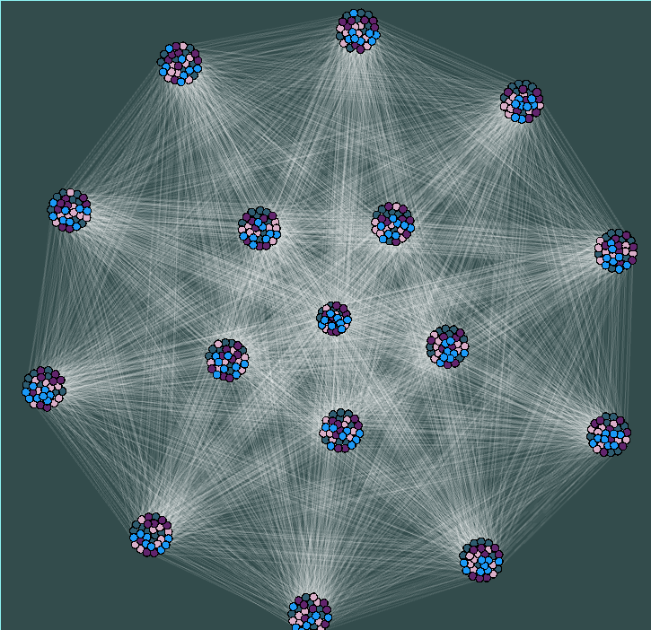

# Graph-OpenGL

Visualise networks (graphs) using OpenGL.

Due to the nature of my master's thesis, I need to visualise communities in networks. I am dissatisfied by the usage of
existing visualisation tools such as Gephi, iGraph etc and wanted to learn OpenGL for quite some time now.
In consequence, I am developping this software to fit my visualisation needs.
For now I'm looking to add features that helps me towards this specific purpose.

  

* TODO 
- [ ] Make the coloring better. (Don't use random colors)
- [ ] Implement different spatialisation algorithms (force Atlas, spring)
- [ ] Implement a "stepping" behaviour. To visualise movements of vertices from one partition to the other
- [ ] Repulsion force is the bottleneck of the simulation ($$\mathcal{O}(n^2)$$). Implements Barnes-Hut approximation for the repulsion force ($$\mathcal{O}(n\log(n))$$)
- [ ] Check for a more appropriate line shader
- [ ] Find a better way to write callbacks inside the `App` class

* DONE 
- [X] Read partition file and implement coloring per partition. Dynamically choose the partitioning to show with the keyboard.
- [X] Adapt the zooming behaviour to zoom towards the cursor. (instead of the center of the scene)
- [X] Implement a proper command line interface
